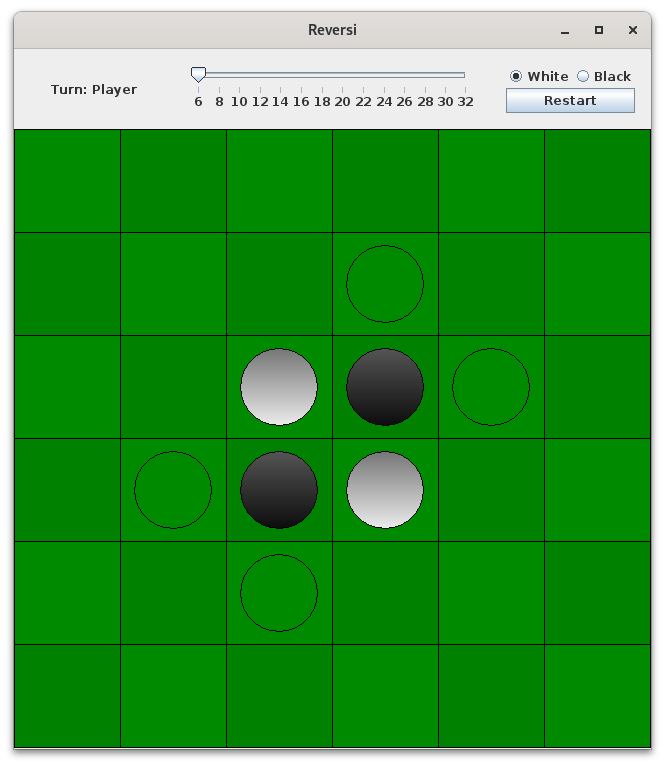

# Реверси
[RU](README-ru.md "RU") [EN](README.md "EN")

Пример использования Swing для создания программ с графическим интерфейсом на java.

## Правила игры
### Стартовая позиция и условия победы

Реверси (другое название Отелло) — настольная стратегическая игра для двух человек. Игра начинается с игрового поля размером 6х6 плиток, размер которого может быть изменен пользователем (см. рисунок ниже).



Цель игры - собрать на доске больше камней, чем у вашего противника. Игра заканчивается, если все фишки заняты камнями или если ни один из игроков не может сделать правильный ход.

### Размещение камней
В свой ход игрок кладет на доску камень своего цвета. Камень должен быть размещен таким образом, чтобы он захватывал по крайней мере один камень противника. Если игрок не может захватить камень любым доступным ходом, он пропускает свой ход.
Игра начинается с размещения на доске 4 камней, два из которых принадлежат белым, а два - черным игрокам (см. рисунок выше).

### Захват камней
Игроки должны расположить камни таким образом, чтобы они образовывали непрерывную линию между двумя камнями своего цвета в любом направлении (по вертикали, горизонтали или диагонали). Все камни, попавшие в эту линию будут захвачены игроком и изменят цвет.

Если ни один из игроков не может сделать ход в результате которого будет захвачен по крайней мере один камень противника, игра заканчивается.

## Инструкция
В этой реализации игры соперник всегда представлен компьютером. Вы можете решить, каким цветом будет играть игрок, а каким компьютер. Компьютер выполняет тот ход, при котором будет захвачено наибольшее количество камней.

Игра ведется с помощью компьютерной мыши. При наведении курсора мыши на клетку, которая является допустимым ходом, эта клетка подсвечивается. Также выделяются все клетки, которые являются допустимыми ходами.

Меню содержит:
* информацию о текущем игроке, а по окончании игры - информацию о победителе.
* кнопку, которая перезапускает игру
* информацию о текущих размерах игрового поля
* компонент JSlider, который используется для установки размера игрового поля (из допустимых значений 6,8,10,12 и т.д.).

При нажатии клавиши R на клавиатуре игра перезапускается. При нажатии клавиши ESC игра закрывается.

## Сборка и запуск
Установите OpenJDK 11+. Клонируйте репозиторий и запустите make.

```bash
git clone https://github.com/zherlitsyn/reversi
cd reversi
make
```

Затем запустите программу

```bash
java -jar Reversi.jar
```
