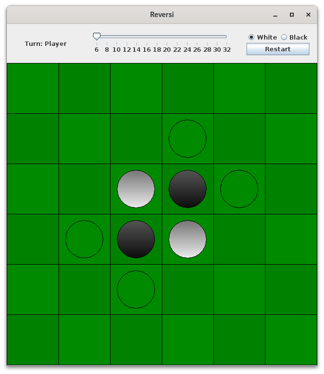

# Reversi
[RU](README-ru.md "RU") [EN](README.md "EN")

An example of using Swing to create programs with a graphical interface in java.

## Game rules
### Starting position and the win condition

The game is also known as Othello. The game starts with a board of 6x6 tiles, the size of the board can be changed by the user (the picture below).



The goal of the game is to have more stones on the board than your opponent. The game ends if all tiles are occupied by stones, or if neither player can play a valid move.

### Placing the stones
The player places a stone of their color onto the board on their turn. The stone must be placed in such a way, that it captures at least one stone of their opponent. If a player cannot capture a stone with any available move, they pass their turn.
The game begins with 4 stones placed on the board, two stones belong to the white and two stones belong to the black player (see picture above).

### Capturing stones
The players must place stones in such a way, that they trap opposing stones in a continuous line between two stones of their own color in any direction (vertically, horizontally, or diagonally).
All the trapped stones are captured by the player and change color.

If neither player can make a capturing move the game ends.

## Manual
The game is played against a computer opponent. You can decide which color is played by the player and which by the computer. The computer performs the move that captures the most stones.

The game is played with the mouse. When a mouse hovers above a tile that is a valid move, this tile is highlighted. All the tiles that are valid moves are highlighted.

The menu contain:
* information about the current player, or when the game ends, information about the winner.
* a button that resets the game
* information about the current dimensions of the board
* a JSlider component that is used to set the size of the game board (out of the valid values 6,8,10,12, etc.).

By pressing the R key on the keyboard the game resets. By pressing the ESC key the game closes.

## Building
Install OpenJDK 11+. Сlone the repository and run make.

```bash
git clone https://github.com/zherlitsyn/reversi
cd reversi
make
```

Then run the program

```bash
java -jar Reversi.jar
```
